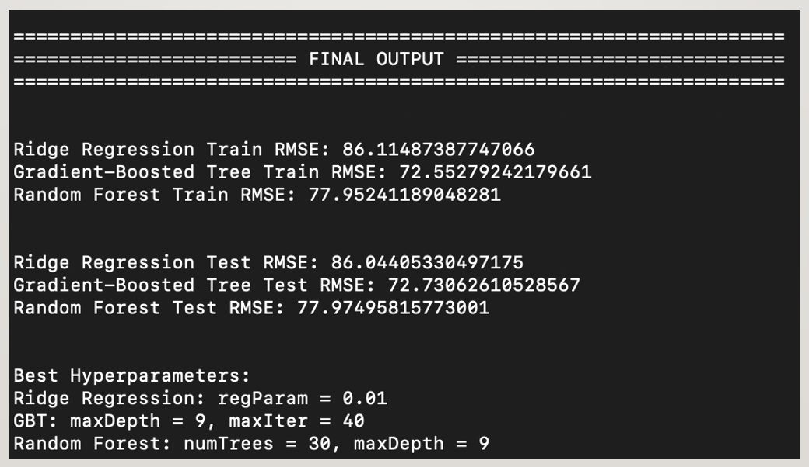

# Distributed_Computing_SparkHadoop

Build a machine learning model using Apache Spark's MLlib to predict air pressure based on geographical and weather data. The project includes data preprocessing, model training, and validation. Detailed setup instructions and deliverables are provided. 


---

## Description and Tasks

- Use MLlib of Apache Spark to build a machine learning model that predicts the air pressure based on geographical parameters and weather conditions.
    - Download the dataset from [https://www.ncei.noaa.gov/data/global-hourly/archive/csv/2023.tar.gz](https://www.ncei.noaa.gov/data/global-hourly/archive/csv/2023.tar.gz), whose documentation can be found at [https://www.ncei.noaa.gov/data/global-hourly/doc/](https://www.ncei.noaa.gov/data/global-hourly/doc/).
    - Build machine learning models to predict the column PRESSURE by using other columns including `LATITUDE`, `LONGITUDE`, `ELEVATION`, `WIND_DIRECTION`, `WIND_SPEED`, `CEILING_HEIGHT`, `VISIBILITY`, `AIR_TEMPERATURE` and `DEW_POINT_TEMPERATURE`. Note that the csv files contain missing data, which must be removed before training. The missing data are denoted using some special values described in the documentation.
    - During training, set the ratio of the training set and test set to 7:3. Use the validation tools provided by MLlib to find the best model. Print the training error and the test error on screen.

---

# Instructions to Run the Apache Spark Pipeline

## Step 1: Install Java

- Download `Java` installer at https://www.oracle.com/java/technologies/javase/javase8u211-later-archive-downloads.html
- Installation normally would default `JAVA_HOME` to `/Library/Internet Plug-Ins/JavaAppletPlugin.plugin/Contents/Home`. If this is not the case, please remember to update `JAVA_HOME` in Step 5.
- If everything is done correclty,  this following output is expected when running below CMD

```bash
java -version
```

```bash
 	java version "1.8.0_391"
	Java(TM) SE Runtime Environment (build 1.8.0_391-b13)
	Java HotSpot(TM) 64-Bit Server VM (build 25.391-b13, mixed mode)
```

## Step 2: Install Scala

- Download `Scala` installer at https://downloads.lightbend.com/scala/2.12.4/scala-2.12.4.tgz
- Unzip the `scala-2.12.4.tgz` at path location `/usr/local/`
- If everything is done correclty,  this following output is expected when running below CMD

```bash
scala -version
```

```bash
 	Scala code runner version 2.12.4 -- Copyright 2002-2017, LAMP/EPFL and Lightbend, Inc.
```

## Step 3: Install Maven

- Download `Maven` installer at  https://archive.apache.org/dist/maven/maven-3/3.5.2/binaries/apache-maven-3.5.2-bin.tar.gz
- Unzip the `apache-maven-3.5.2` at location `/usr/local/`
- If everything is done correclty,  this following output is expected when running below CMD

```bash
mvn -version
```

```bash
 	Apache Maven 3.5.2 (138edd61fd100ec658bfa2d307c43b76940a5d7d; 2017-10-18T15:58:13+08:00)
 	Maven home: /usr/local/apache-maven-3.5.2
 	Java version: 1.8.0_391, vendor: Oracle Corporation
 	Java home: /Library/Internet Plug-Ins/JavaAppletPlugin.plugin/Contents/Home
 	Default locale: en_SG, platform encoding: UTF-8
 	OS name: "mac os x", version: "14.2.1", arch: "aarch64", family: "mac"
```

## Step 4: Install Spark and Hadoop

- Download `Spark` and `Hadoop` installer at https://archive.apache.org/dist/spark/spark-3.0.0/spark-3.0.0-bin-hadoop2.7.tgz
- Unzip the `spark-3.0.0-bin-hadoop2.7` at location `/usr/local/`
- If everything is done correclty,  this following output is expected when running below CMD

```bash
spark-submit --version
```

```bash
    Welcome to
          ____              __
         / __/__  ___ _____/ /__
        _\ \/ _ \/ _ `/ __/  '_/
       /___/ .__/\_,_/_/ /_/\_\   version 3.0.0
          /_/
                            
    Using Scala version 2.12.10, Java HotSpot(TM) 64-Bit Server VM, 1.8.0_391
    Branch HEAD
    Compiled by user ubuntu on 2020-06-06T11:32:25Z
    Revision 3fdfce3120f307147244e5eaf46d61419a723d50
    Url https://gitbox.apache.org/repos/asf/spark.git
    Type --help for more information.
```

## Step 5: Set Up Environment Variables

- Here are the exact set of environment variables we have in our systems:

```bash
    export PATH="/opt/homebrew/bin:/opt/homebrew/sbin:/opt/local/bin:/opt/local/sbin:/Library/Frameworks/Python.framework/Versions/3.11/bin:/usr/local/bin:/System/Cryptexes/App/usr/bin:/usr/bin:/bin:/usr/sbin:/sbin"
    export PATH="/Users/jameslim/miniconda3/bin:$PATH"

    export SPARK_HOME="/usr/local/spark-3.0.0-bin-hadoop2.7"
    export PYTHONPATH=$SPARK_HOME/python:$SPARK_HOME/python/lib/py4j-0.10.9-src.zip:$PYTHONPATH
    export PATH="/usr/local/scala-2.12.4/bin:/usr/local/apache-maven-3.5.2/bin:$SPARK_HOME/bin:$SPARK_HOME/python:$PATH"

    export JAVA_HOME="/Library/Internet Plug-Ins/JavaAppletPlugin.plugin/Contents/Home"

    export PYSPARK_SUBMIT_ARGS="--master local[8] pyspark-shell"
    export PYSPARK_PYTHON=python3
    export PYSPARK_DRIVER_PYTHON=python3
```

## Step 6: Set Up Conda Environment

- Create a new conda envirionment called `bigdata` based on packages that are dumped into YAML file below.
- Run below command in the terminal.

```bash
conda env create --file bigdata.yaml
```

## Step 7: Activate `bigdata` Conda Environment

- Run below command in the terminal.

```bash
conda activate bigdata
```

## Step 8: Run Apache Spark Pipeline 

- The Apache Spark pipeline script has 2 input arguments:
    - First argument is the path of directory `2023`. Please change said input argument according to directory `2023` location in your system.
    - Second argument is the path to cleaned and combined CSV data
- This directory `2023` has the size of 52.24 GB and is unzipped upon downloading the tar file [https://www.ncei.noaa.gov/data/global-hourly/archive/csv/2023.tar.gz](https://www.ncei.noaa.gov/data/global-hourly/archive/csv/2023.tar.gz)
- Run below command in the terminal


```bash
CMD: python3 script.py <path_of_2023_directory> <path_of_cleaned_and_combined_CSV_data>

Example: python3 script.py /Users/jameslim/Downloads/2023/ ./combined_df.csv
```
---

# Data Preprocessing

- Initial Steps:
    - Check for Preprocessed Data:
        - If the preprocessed data file exists, read it directly.
        - If not, proceed to read and preprocess raw data files.
- Reading and Filtering Data:
    - Read Raw CSV Files:
        - Utilize PySpark to read multiple CSV files from the specified directory.
        - Enable header and schema inference.
    - Select Relevant Columns:
        - Keep columns: `LATITUDE`, `LONGITUDE`, `ELEVATION`, `WND`, `CIG`, `VIS`, `TMP`, `DEW`, `SLP`.
- Handle Missing Data:
    - Filtering Conditions:
        - `WND`: Discards rows where the first 3 characters are `999` or characters 6-9 are `9999`.
        - `CIG`: Discard rows where the first 5 characters are `99999`.
        - `VIS`: Discard rows where the first 6 characters are `999999`.
        - `TMP`, `DEW`: Discard rows where the first 5 characters are `+9999`.
        - `SLP`: Discard rows where the first 5 characters are `99999`.
- Transform Columns:
    - Column Transformation:
        - Extract relevant parts of each column and cast to appropriate data types.
        - Rename columns for consistency.

---

# Min-Max Scaling

- Feature Columns:  
    - `LATITUDE`, `LONGITUDE`, `ELEVATION`, `WIND_DIRECTION`, `WIND_SPEED`, `CEILING_HEIGHT`, `VISIBILITY`, `AIR_TEMPERATURE`, `DEW_POINT_TEMPERATURE`.

- Scaling Technique:
    - Min-Max Scaling:
        - Apply Min-Max scaling manually based on predefined min and max values for each feature obtained from the documentation, and not based on available samples.
        - Formula: scaled_value = (value - min) / (max - min)

- Predefined Min-Max Values:  
    - `LATITUDE`: [-90000, 90000]
    - `LONGITUDE`: [-179999, 180000]
    - `ELEVATION`: [-400, 8850]
    - `WIND_DIRECTION`: [1, 360]
    - `WIND_SPEED`:  [0, 900]
    - `CEILING_HEIGHT`: [0, 22000]
    - `VISIBILITY`: [0, 160000]
    - `AIR_TEMPERATURE`: [-932, 618]
    - `DEW_POINT_TEMPERATURE`: [-982, 368]

---

# Train-Test Split

- Data Split
    - Training Set: 70% of the data.
    - Test Set: 30% of the data.
    - Purpose: Ensure that the model is evaluated on unseen data to assess its performance.

- Implementation
    - Utilize `randomSplit` method in PySpark to split the dataset.
    - Set a random seed for reproducibility.

---

# Model Pipeline

- Feature Engineering
    - Vector Assembler:
        - Combine features into a single vector.

- Model Selection
    - Ridge Regression:
        - Using Linear Regression with `elasticNetParam=0.0` to simulate Ridge Regression.
    - Gradient-Boosted Tree Regression (GBT):
        - Employ `GBTRegressor` for capturing non-linear relationship.
    - Random Forest Regression:
        - Utilize `RandomForestRegressor` for ensemble learning.

---

# Hyperparameter Tuning

- Ridge Regression:
    - `regParam`: [0.01, 0.1, 1.0]
- GBT:
    - `maxDepth`: [5, 7, 9]
    - `maxIter`: [20, 30, 40]
- Random Forest:
    - `numTrees`: [20, 30, 40]
    - `maxDepth`: [5, 7, 9]

- Cross-Validation
    - Utilize `CrossValidator` for each model to perform 3-fold cross-validation.

---

# Model Evaluation

- Evaluation Metrics
    - Root Mean Squared Error (RMSE):
        - Measure the average magnitude of the error.

- Evaluating Process:
    - Training:
        - Fit models using training data.
        - Predict and evaluate on training set.
    - Testing:
        - Predict and evaluate on test set.

- Evaluator:
    - Use `RegressionEvaluator` with `rmse` metric for evaluation.

---

# Results 

- Time taken to comlete the run: 01 hour 15 minutes (with 8 cores of Mac M1 Silicon Chip)



---

# Conclusion

- Summary: 
    - Successfully built and evaluated 3 regression models under Spark MLlib.
    - Ridge Regression, Gradient-Boosted Tree, and Random Forest models were compared.
    - Model performance evaluated using RMSE on both training and test sets.
 
- Best Performance: 
    - Gradient-Boosted Tree with train RMSE = 72.55 and test RMSE = 72.73 with best hyperparameters maxDepth=9 and maxIter=40 
 
- Future Work: 
    - Further optimization and feature engineering.
    - Exploring additional models and techniques.
